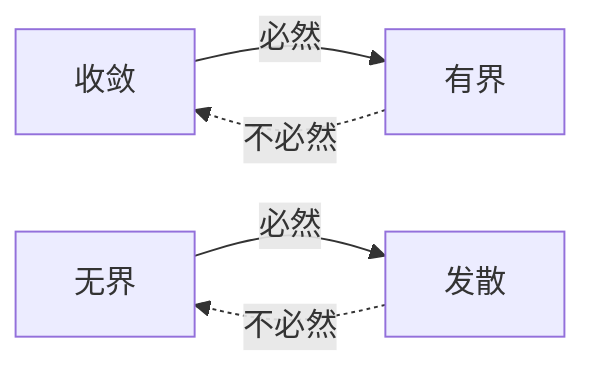

# 第一节函数与极限

> 来源：Obsidian/10-学业与考试/考研/高数/第一节函数与极限.md

## 映射与函数

### 函数的几种特性

1.  函数有界性
    - 有上界
    - 有下界
    - 有界（上界、下界）
    - 无界
2.  函数单调性
    - 单调增
    - 单调减
3.  函数奇偶性
    $$
    \begin{aligned}
    f(-x) &= f(x) \quad \text{(偶函数)} \\
    f(-x) &= -f(x) \quad \text{(奇函数)}
    \end{aligned}
    $$
        	偶函数的图形关于y轴对称，奇函数的图形关于原点对称，且若$f(x)$在$x=0$处有定义，则$f(0)=0$
4.  函数周期性
    定义：若存在实数$T>0$,对于任意x,恒有$f(x+T)=f(x)$则称$y=f(x)$为周期函数.使得上式成立的最小正数T称为最小正周期，简称为函数$f(x)$的周期.

### 反函数与复合函数

1. 反函数
   _定义 ：_ 设函数 $y = f(x)$ 的定义域为 $D$，值域为 $R_{y}$。若对任意 $y \in R_{y}$，有唯一确定的 $x \in D$，使得 $y = f(x)$，则记为$x = {f^{-1}(y)}$，称其为函数 $y = f(x)$ 的反函数。
   _注：_ 函数 $y = f(x)$ 与其反函数$y = {f^{-1}(x)}$的图像关于$y=x$对称。
2. 复合函数
   定义：设 $y = f(u)$ 的定义域为 $D_{f}$，$u = g(x)$ 的定义域为 $D_{g}$，值域为 $R_{g}$。若 $D_{f} \cap R_{g} \neq \varnothing$，则称函数 $y = f[g(x)]$ 为函数 $y = f(u)$ 与 $u = g(x)$ 的复合函数。它的定义域为：
   $$
   \{ x \mid x \in D_{g}, g(x) \in D_{f} \}
   $$
3. 函数运算
   $$ \begin{aligned} f \pm g &: (f \pm g)(x) = f(x) \pm g(x) \\ f \cdot g &: (f \cdot g)(x) = f(x) \cdot g(x) \\ \frac{f}{g} &: \left(\frac{f}{g}\right)(x) = \frac{f(x)}{g(x)} \end{aligned} $$
4. 初等函数 - 幂函数 $y = x^{\mu} \quad (\mu \in \mathbb{R})$ - 指数函数 $y = a^{x} \quad (a > 0,\ a \neq 1)$ - 对数函数 $y = \log_{a}x \quad (a > 0,\ a \neq 1)$ - 三角函数 $$\begin{aligned} y &= \sin x, & y &= \cos x, \\ y &= \tan x, & y &= \cot x \end{aligned}$$ - 反三角函数
   $$ \begin{aligned}y = \arctan x ,\\ y = \arcsin x,\\ y = \arccos x\end{aligned}$$

5. **双曲正弦函数**

$sinh(x) = \frac{(e^x - e^{-x})}{2}$

反函数 $arcsinh(y) = \ln(y + \sqrt{y^2 + 1})$ _等价无穷小为 $x$_

## 极限

### 收敛函数的性质

1. 唯一性：收敛数列的极限是唯一的
2. 有界性：收敛数列必有界

3. 保号性
   若 $\lim_{n \to \infty} x_n = a$，且 $a > 0$（或 $a < 0$），则 $\exists N$，当 $n > N$ 时，都有 $x_n > 0$（或 $x_n < 0$）。
4. 收敛数列与其子列之间的关系
   $$ \lim*{n \to \infty} x_n = a \Leftrightarrow \lim*{k \to \infty} x*{2k-1} = \lim*{k \to \infty} x\_{2k} = a $$

### 极限公式

#### 一、等价无穷小公式

#### 二、两个重要极限公式

##### 1. 自然指数极限

$$\lim_{x \to 0} (1 + x)^{\frac{1}{x}} = e \quad \text{或} \quad \lim_{n \to \infty} \left(1 + \frac{1}{n}\right)^n = e$$$$ \lim\_{x \to \infty} \left(1 + \frac{k}{x}\right)^x = e^k$$

##### 2. 正弦函数极限

$$\lim_{x \to 0} \frac{\sin x}{x} = 1$$

> [!note] 组合公式
> $$\lim_{x \to \infty} \left( 1 + \frac{k}{x} \right)^x = e^k$$
> $$ \lim\_{x \to 0} \frac{a^x - 1}{x} = \ln a \quad (a>0)$$

#### 三、泰勒公式

若函数 $f(x)$ 在点 $x = a$ 处具有 $n$ 阶导数，则在该点附近可以展开为：

$$
f(x) = f(a) + f'(a)(x-a) + \frac{f''(a)}{2!}(x-a)^2 + \cdots + \frac{f^{(n)}(a)}{n!}(x-a)^n + R_n(x),
$$

其中 $R_n(x)$ 为余项，常见的余项形式有拉格朗日余项和佩亚诺余项：

- _拉格朗日余项_：$$( R_n(x) = \frac{f^{(n+1)}(\xi)}{(n+1)!}(x-a)^{n+1} )（ \xi 介于a与x之间）。$$
- _佩亚诺余项_：$$( R_n(x) = o((x-a)^n) )（当 ( x \to a ) 时）。$$
  **麦克劳林公式**（( a = 0 ) 时的特例）：
  $$
  f(x) = f(0) + f'(0)x + \frac{f''(0)}{2!}x^2 + \cdots + \frac{f^{(n)}(0)}{n!}x^n + R_n(x).
  $$

##### 重要函数的泰勒公式

$\sin x = x - \frac{x^3}{3!} + o(x^3),$ $\cos x = 1 - \frac{x^2}{2!} + \frac{x^4}{4!} + o(x^4),$

$\arcsin x = x + \frac{x^3}{3!} + o(x^3),$ $\tan x = x + \frac{x^3}{3} + o(x^3),$

$\arctan x = x - \frac{x^3}{3} + o(x^3),$ $\ln(1+x) = x - \frac{x^2}{2} + \frac{x^3}{3} + o(x^3),$

$e^x = 1 + x + \frac{x^2}{2!} + \frac{x^3}{3!} + o(x^3),$

$(1+x)^{\alpha} = 1 + \alpha x + \frac{\alpha(\alpha-1)}{2!} x^2 + o(x^2).$

#### 四、多项式函数在无穷远处的极限

$$
\lim _{x \rightarrow \infty} \frac{a_{n} x^{n} + a_{n-1} x^{n-1} + \cdots + a_{1} x + a_{0}}{b_{m} x^{m} + b_{m-1} x^{m-1} + \cdots + b_{1} x + b_{0}} =
\begin{cases}
\frac{a_{n}}{b_{m}}, & n = m, \\
\infty, & n > m, \\
0, & n < m.
\end{cases}
$$

---

## 不等式

### ​​一、基础不等式​​

1. ​​三角不等式​​
   - $|a + b| \leq |a| + |b|$
   - $||a| - |b|| \leq |a - b|$

2. ​​均值不等式​​
   - 算术-几何平均不等式（AM-GM）：
     $\frac{a_1 + a_2 + \cdots + a_n}{n} \geq \sqrt[n]{a_1 a_2 \cdots a_n} \quad (a_i > 0)$

3. ​​柯西-施瓦茨不等式（Cauchy-Schwarz）​​
   - 离散形式：
     $\left( \sum_{k=1}^n a_k b_k \right)^2 \leq \left( \sum_{k=1}^n a_k^2 \right) \left( \sum_{k=1}^n b_k^2 \right)$

   - 积分形式：
     $\left( \int f(x)g(x) \, dx \right)^2 \leq \int f^2(x) \, dx \cdot \int g^2(x) \, dx$

### ​二、​基本不等式链​​

对两正数 $a, b > 0$，不等式链化为：

$$
\sqrt{\frac{a^2 + b^2}{2}} \geq \frac{a + b}{2} \geq \sqrt{ab} \geq \frac{2ab}{a + b}
$$

当且仅当 $a = b$ 时​​，所有平均值相等。

其中从左到右依次为：

1. ​​平方平均
2. ​​算术平均​​
3. ​​几何平均
4. ​​调和平均

常用的是：

$$
\frac{a + b}{2} \geq \sqrt{ab} \quad \text{（基本不等式）}
$$

**一般式：**

设 $a_1, a_2, \dots, a_n > 0$（均为正实数），则有：

$$
\sqrt{\frac{a_1^2 + a_2^2 + \cdots + a_n^2}{n}}
\ \geq \
\frac{a_1 + a_2 + \cdots + a_n}{n}
\ \geq \
\sqrt[n]{a_1 a_2 \cdots a_n}
\ \geq \
\frac{n}{\frac{1}{a_1} + \frac{1}{a_2} + \cdots + \frac{1}{a_n}}
$$

*​等号成立条件：​*​​​当且仅当 $a_1 = a_2 = \cdots = a_n$ 时​​，所有平均值相等。

### ​​三、极限与级数中的不等式​​

4. ​​夹逼准则（Squeeze Theorem）​​
   - 若 $a_n \leq b_n \leq c_n$ 且 $\lim a_n = \lim c_n = L$，则 $\lim b_n = L$。
   - 应用：数列极限、函数极限（如 $\lim_{x \to 0} x \sin \frac{1}{x} = 0$）。
5. ​​伯努利不等式（Bernoulli）​​
   - 形式：$(1 + x)^n \geq 1 + nx \quad (x \geq -1, n \in \mathbb{N})$。
   - 应用：数列放缩（如证明 $n^{1/n} \to 1$）。
6. ​​泰勒展开余项不等式​​
   - 拉格朗日余项：$|R_n(x)| \leq \frac{M}{(n+1)!} |x|^{n+1}$（`M` 为高阶导数的界）。
   - 应用：函数逼近、误差估计。

### 四、取整函数中的不等式

$$x-1<[x]\le x$$

**例题：**
求极限： $$ I = \lim\_{x \to 0} x \left[ \frac{10}{x} \right] $$ 其中 $[\cdot]$ 为取整符号（地板函数）。

重要不等式：[[第二节数列极限#(2) 利用重要不等式]]

---

## 无穷等比级数求和公式​​

### ​​1. 公式定义​​

对于一个首项为 $a$、公比为 $r$（$|r| < 1$）的​​无穷等比级数​​：
$$S = a + ar + ar^2 + ar^3 + \cdots$$

其和可以表示为：
$$S = \frac{a}{1 - r}, \quad \text{当} \ |r| < 1$$

**关键点​​**

- ​收敛条件​​：$|r| < 1$，否则级数发散（和无限大或振荡）。
- ​首项 a​：级数的第一项。
- ​公比 r​：每一项与前一项的比值。

---

### ​​2. 公式推导​​​

1. 先考虑​前 `n` 项​​的等比级数和：
   $$S_n = a + ar + ar^2 + \cdots + ar^{n-1}$$
2. 等比数列求和公式：
   $$S_n = \frac{a(1 - r^n)}{1 - r}$$
3. 当 $n \to \infty$，若 $|r| < 1$，则 $r^n \to 0$，所以：
   $$S = \lim_{n \to \infty} S_n = \frac{a}{1 - r}$$​

### ​3. 收敛条件​​

- ​$|r| < 1​$：级数收敛，和有限。
- $​|r| \geq 1$​：
  - $r = 1$：级数变为 $a + a + a + \cdots$，发散到无穷。
  - $r = -1$：级数变为 $a - a + a - a + \cdots$，振荡无极限。
  - $|r| > 1$：$r^n$ 无限增大，级数发散。

## 未定式的处理方法

### 0∗∞ 型未定式的处理方法

1. 格式转换
   $$
   0\times \infty\begin{cases}
     & \frac{0}{\frac{1}{ \infty }} = \frac{0}{0}  \\
     & \frac{\infty}{\frac{1}{ 0 }} = \frac{\infty}{\infty}
   \end{cases}
   $$
2. 注意在转换时，哪一项结构简单放在下面
   简单：$x^{\alpha },e^{\beta x} ,\sin \gamma x$ 等
   复杂：$arcsin x,arctan x,ln x$ 等

例题：

$$
\text { 求极限 } \lim _{x \rightarrow 1^{-}} \ln x \ln (1-x)
$$

【注】事实上，当 $\alpha > 0$ 时， $$ \lim*{x \to 0^{+}} x^{\alpha} \ln x = \lim*{x \to 0^{+}} \frac{\ln x}{x^{-\alpha}} = \lim*{x \to 0^{+}} \frac{x^{-1}}{-\alpha x^{-\alpha - 1}} = -\frac{1}{\alpha} \lim*{x \to 0^{+}} x^{\alpha} = 0, $$ 本题中 $\alpha = 1$。

结论：$\ln x$ 趋于$\infty$的速度太慢了，无法影响$x^{\alpha}$趋于$0$的速度

### ∞-∞ 型未定式的处理方法

**(1) 有分母的情况**
如果函数中有分母，则通分，将加减法变形为乘除法，以便于使用其他计算工具（比如洛必达法则）.

公式示例：

$$
\lim_{x \to 0} \left( \frac{1}{x} - \frac{1}{\sin x} \right) = \lim_{x \to 0} \frac{\sin x - x}{x \sin x} \quad \text{（通分后转为 $\frac{0}{0}$ 型）}
$$

**(2) 无分母的情况**
如果函数中没有分母，则可以通过提取公因式或者作倒代换，出现分母后，再利用通分等恒等变形的方法，将加减法变形为乘除法.

公式示例：

$$
\lim_{x \to +\infty} \left( \sqrt{x^2+1} - x \right) = \lim_{x \to +\infty} x \left( \sqrt{1+\frac{1}{x^2}} - 1 \right) \quad \text{（提取公因式）}
$$

### ∞⁰型未定式的处理方法

**公式：**
$$\color{red} u^v = e^{v \ln u} $$

_例题_
求极限：
$$ \lim\_{x\to+\infty}\left(x+\sqrt{1+x^{2}}\right)^{\frac{1}{x}} $$

_解题步骤_

1. 指数化处理：
   $$\left(x+\sqrt{1+x^{2}}\right)^{\frac{1}{x}} = e^{\frac{1}{x} \ln \left(x+\sqrt{1+x^{2}}\right)}$$
2. 计算指数部分极限：
   $$\lim_{x\to+\infty} \frac{\ln \left(x+\sqrt{1+x^{2}}\right)}{x}$$

3. 洛必达法则应用 对指数部分应用洛必达法则：
   $$\frac{d}{dx}\ln(x+\sqrt{1+x^2}) = \frac{1+\frac{x}{\sqrt{1+x^2}}}{x+\sqrt{1+x^2}} = \frac{1}{\sqrt{1+x^2}}$$
   因此：
   $$= e^{\lim_{x\rightarrow+\infty}\frac{1/\sqrt{1+x^2}}{1}}$$
4. 极限计算
   $$= e^{\lim_{x\rightarrow+\infty}\frac{1}{\sqrt{1+x^2}}} = e^0 = 1$$

### 1^∞ 型未定式处理方法

**公式：**
$$\color{red} limu^v = e^{lim v\ln (u-1)} $$

_例_
$$ \lim*{x\to 0} \left( \frac{e^{x} + e^{2x} + e^{3x}}{3} \right)^{\frac{e}{x}} $$
*解*
	转换为指数形式​​：
	$$= e^{\lim\limits*{x \to 0} \left( \frac{e}{x} \cdot \frac{e^{x} - 1 + e^{2x} - 1 + e^{3x} - 1}{3} \right)}$$
	拆分极限​​：
	$$= e^{\frac{e}{3} \lim\limits_{x \to 0} \left( \frac{e^{x} - 1}{x} + \frac{e^{2x} - 1}{x} + \frac{e^{3x} - 1}{x} \right)}$$
等价无穷小替换​​（当 $x \to 0$ 时 $e^{t} - 1 \sim t$）：
$$= e^{\frac{e}{3} (1 + 2 + 3)}$$
最终结果​​：
$$= e^{2e}$$

## 间断点的定义与分类

**前提条件**：
函数 $f(x)$ 在点 $x_0$ 的某去心邻域内有定义。 这是讨论间断点的前提。

### 第一类间断点

#### (1) 可去间断点

**定义**：
若极限

$$
\lim_{x\to x_0} f(x) = A \neq f(x_0)
$$

（其中 $f(x_0)$ 可以无定义），则称 $x = x_0$ 为**可去间断点**。

**关键理解**：

- 当左极限=右极限时有可去间断点

#### (2) 跳跃间断点

**定义**： 若函数 $f(x)$ 在 $x_0$ 点的**左极限**与**右极限**均存在，但 $$ \lim*{x\to x*{0}^{-}} f(x) \neq \lim*{x\to x*{0}^{+}} f(x) $$ 则称 $x = x_0$ 为**跳跃间断点**。
**关键理解**：

- 左右极限存在但不相等 → 函数图像在 $x_0$ 处出现“跳跃”。
- 与可去间断点的区别：可去间断点的左右极限**相等**（但≠函数值）。

### 第二类间断点 (没有一类重要)

#### (3) 无穷间断点

**定义**
若函数 _f(x)_ 在 $x \to x_0$（含单侧极限）时满足：

$$
\lim_{x\to x_0} f(x) = \infty \quad \text{或} \quad \lim_{x\to x_0^+} f(x) = \infty \quad \text{或} \quad \lim_{x\to x_0^-} f(x) = \infty
$$

则称 $x = x_0$ 为 **无穷间断点**。

**关键理解**

- 极限趋向于无穷大（∞ 或 -∞）→ 函数值在 $x_0$ 处“爆炸性”发散
- 与第一类间断点的区别：可去/跳跃间断点的极限为**有限值**

#### (4) 振荡间断点

---
