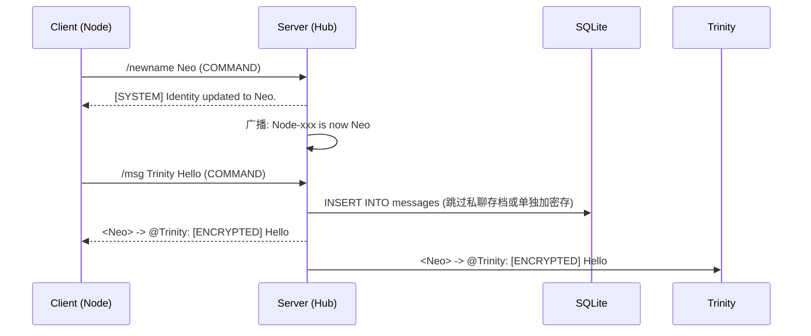

> 来源：Obsidian/30-项目与实践/项目说明/GO项目/黑客风-终端聊天室.md

# hacker-chat

```text
 _               _                   _           _
| |__   __ _  ___| | _____ _ __     | |__   __ _| |_
| '_ \ / _` |/ __| |/ / _ \ '__|____| '_ \ / _` | __|
| | | | (_| | (__|   <  __/ | |_____| | | | (_| | |_
|_| |_|\__,_|\___|_|\_\___|_|       |_| |_|\__,_|\__|
```

一个基于 `Go` + `WebSocket` + `Bubble Tea` 的终端黑客风聊天室。

支持：

- **公聊广播**与**私聊（精准路由）**
- **指令系统**（`/whoami`、`/ping`、`/newname`、`/msg`、`/clear`）
- **SQLite 消息持久化**
- **历史回溯**：新客户端连入自动下发最近历史（瞬时渲染）
- **视觉特效**：终端打字机 / 乱码解密过渡

---

## 📂 项目结构

```Plaintext
hacker-chat/
├── cmd/
│   ├── client/main.go         # 客户端入口 (UI渲染/指令拦截)
│   └── server/main.go         # 服务端入口 (启动Hub/数据库挂载)
├── internal/
│   ├── config/config.go       # 全局配置常量（地址/端口/口令）
│   ├── protocol/message.go    # C/S 共享消息协议定义
│   ├── server/
│   │   ├── hub.go             # 连接管理与广播路由
│   │   ├── client_conn.go     # 单连接读写/命令解析
│   │   └── db.go              # SQLite 持久化与历史查询
│   └── client/
│       ├── network.go         # 客户端网络层 (WebSocket Uplink)
│       ├── ui.go              # Bubble Tea UI 状态机
│       ├── style.go           # Lipgloss 样式配色板
│       └── effects.go         # 启动伪装与视觉特效运算
├── go.mod
└── README.md
```

## 🛠️ 技术栈

- Go 1.24+
- [gorilla/websocket](https://github.com/gorilla/websocket) - 全双工通信底层
- [charmbracelet/bubbletea](https://github.com/charmbracelet/bubbletea) - Elm 架构终端 UI 框架
- [charmbracelet/lipgloss](https://github.com/charmbracelet/lipgloss) - 终端样式排版引擎
- [modernc.org/sqlite](https://gitlab.com/cznic/sqlite) - 纯 Go 实现的 SQLite 驱动（**零 CGO 依赖，完美跨平台编译**）

---

## 📡 消息流与协议架构

> [!info] 消息流转机制 (Message Flow)
>
> 1. 客户端输入普通文本 → 发送 `CHAT` 消息。
> 2. 客户端输入 `/xxx` → 拦截并发送 `COMMAND` 消息。
> 3. 服务端解析命令：生成系统反馈，或构建 `PRIVATE` 消息投入 Hub。
> 4. Hub 广播时：所有消息先落盘 SQLite；若为 `PRIVATE`，仅投递给发送端与目标端。
> 5. 新客户端连接：查询最近 50 条公开历史 → `HISTORY` 打包下发 → 客户端瞬时渲染。



### 数据协议定义

`internal/protocol/message.go`

- `type`: `SYSTEM` | `CHAT` | `COMMAND` | `PRIVATE` | `HISTORY`
- `sender`: 发送者代号
- `target`: 接收者代号（私聊时使用，其他留空）
- `content`: 正文内容 / JSON 序列化的历史数组
- `timestamp`: RFC3339 时间戳

---

## 💾 数据库设计

服务端启动时自动挂载/创建 `matrix.db`。读取历史时按 `id DESC LIMIT 50` 获取最近消息，反转回时间正序后下发。默认过滤 `PRIVATE` 私聊记录。

```sql
CREATE TABLE IF NOT EXISTS messages (
    id INTEGER PRIMARY KEY AUTOINCREMENT,
    msg_type TEXT NOT NULL,
    sender TEXT NOT NULL,
    target TEXT,
    content TEXT NOT NULL,
    created_at DATETIME DEFAULT CURRENT_TIMESTAMP
);
```

---

## ⚙️ 配置与运行

> [!warning] 安全须知
>
> 仓库默认只提供 `internal/config/config.example.go.txt` 模板文件，真实配置请勿提交至 Git。

**配置脱敏流程：**

1. `cp internal/config/config.example.go.txt internal/config/config.go`
2. 填入真实 `ServerAddr` 和 `Passphrase`。
3. 若文件已被 Git 追踪，执行 `git rm --cached internal/config/config.go`。

### 本地启动

**启动母体 (Server):**

```bash
go run cmd/server/main.go -addr=:8080
```

**启动终端 (Client):**

```bash
go run cmd/client/main.go -server=127.0.0.1:8080 -pass=thereisnospoon
```

### 终端指令集 (Slash Commands)

- **本地指令**：
  - `/clear`：抹除本地视口内存（不影响服务端历史）。
- **远程指令**：
  - `/whoami`：查询当前节点认证身份。
  - `/ping`：探针测试 Uplink 延迟。
  - `/newname <alias>`：身份伪造（最大长度 16 字符）。
  - `/msg <target> <content>`：建立点对点加密频道。

---

## 📦 跨平台交叉编译指南

由于采用纯 Go 依赖，可以在任意系统上一键编译全平台 Payload。

> [!tip] PowerShell 编译环境
>
> 以下命令适用于 Windows PowerShell。编译完毕后记得使用 `$env:GOOS=""; $env:GOARCH=""` 恢复默认环境变量。

| 目标平台              | 架构  | 编译命令                                                                                  |
| --------------------- | ----- | ----------------------------------------------------------------------------------------- |
| Linux (云服务器部署)  | AMD64 | `$env:GOOS="linux"; $env:GOARCH="amd64"; go build -o matrix-server ./cmd/server`          |
| Windows PC            | AMD64 | `$env:GOOS="windows"; $env:GOARCH="amd64"; go build -o hacker-chat.exe ./cmd/client`      |
| macOS (Apple Silicon) | ARM64 | `$env:GOOS="darwin"; $env:GOARCH="arm64"; go build -o hacker-chat-mac-m1 ./cmd/client`    |
| macOS (Intel)         | AMD64 | `$env:GOOS="darwin"; $env:GOARCH="amd64"; go build -o hacker-chat-mac-intel ./cmd/client` |
| Linux (桌面/普通版)   | AMD64 | `$env:GOOS="linux"; $env:GOARCH="amd64"; go build -o hacker-chat-linux ./cmd/client`      |
| Linux (树莓派/Termux) | ARM64 | `$env:GOOS="linux"; $env:GOARCH="arm64"; go build -o hacker-chat-linux-arm ./cmd/client`  |

---

## 🚀 生产环境部署

### 方案 A：原生进程守护 (Linux)

```bash
chmod +x matrix-server
# 使用 nohup 在后台运行，将日志挂载到 matrix.log
nohup ./matrix-server -addr=":8089" > matrix.log 2>&1 &
tail -f matrix.log
```

### 方案 B：Docker 容器化部署 (推荐)

通过 Docker 部署可以实现极佳的环境隔离与进程管理。

1. 在项目根目录创建 `Dockerfile`：

```dockerfile
FROM golang:1.24-alpine AS builder
WORKDIR /app
COPY . .
RUN go mod download
# 编译 Linux 服务端
RUN CGO_ENABLED=0 GOOS=linux GOARCH=amd64 go build -o matrix-server ./cmd/server

FROM alpine:latest
WORKDIR /root/
COPY --from=builder /app/matrix-server .
# 声明持久化目录，保护 SQLite 数据
VOLUME ["/root/data"]
EXPOSE 8080
CMD ["./matrix-server", "-addr=:8080"]
```

2. 构建并运行：

```bash
docker build -t hacker-chat-server .
docker run -d --name matrix-hub -p 8080:8080 -v $(pwd)/data:/root/data hacker-chat-server
```

---

## ❓ 异常排查排错 (Troubleshooting)

> [!bug] 服务端启动失败 (exit code 1)
>
> - 检查监听端口 (`:8080` / `:8089`) 是否被其他进程占用。
> - 检查程序运行路径是否有**写权限**（首次启动需创建 `matrix.db`）。

> [!bug] 客户端无法连接 (Connection Refused)
>
> - 服务端进程是否彻底存活。
> - 检查云服务器的**安全组/防火墙**是否已放行对应的 TCP 端口。
> - 检查口令 (Passphrase) 是否与服务端匹配，错误口令会被直接 `401 Unauthorized` 拦截并闪退。
