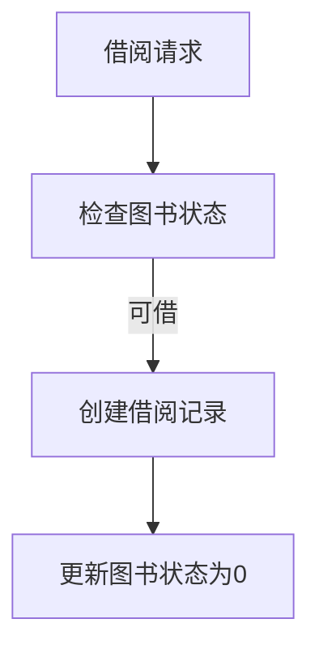

> 来源：Obsidian/30-项目与实践/项目说明/图书管理系统说明/Java后端.md

    开发工具建议使用IDEA专业版

# 环境配置

## 安装Mysql

下载地址：[MySQL ：： 下载 MySQL 安装程序](https://dev.mysql.com/downloads/installer/)


具体安装过程参考：[2024 年 MySQL 8.0 安装 配置 教程 最简易（保姆级）\_mysql安装-CSDN博客](https://blog.csdn.net/m0_52559040/article/details/121843945)

## 为Java配置Mysql

下载mysql-connector-java.jar ： [ MySQL Download MySQL Connector/J ](https://downloads.mysql.com/archives/c-j/)


下载完成后将其解压，然后在IDEA打开后端项目进行配置


选择刚才解压出来的`jar`包

# 快速启动

修改`application.properties`文件配置

数据库配置


AI接口配置，此代码使用的硅基流动的api


# 一、技术栈

- Spring Boot
- Spring Data JPA
- MySQL
- JWT

# 二、项目结构

```
d:\PROJECT\Java\Book_manage\library
├── src/main
│   ├── java/com/example/library
│   │   ├── controller/        # API控制器
│   │   │   ├── BookController.java       - 图书管理接口
│   │   │   ├── UserController.java       - 用户管理接口
│   │   │   └── BorrowRecordController.java - 借阅记录接口
│   │   ├── service/           # 业务逻辑
│   │   │   ├── BookService.java          - 图书业务处理
│   │   │   ├── UserService.java          - 用户认证与权限
│   │   │   └── BorrowRecordService.java  - 借阅流程控制
│   │   ├── dto/               # 数据传输对象
│   │   │   └── UserResponseDTO.java      - 用户信息响应DTO
│   │   ├── repository/        # 数据访问层接口目录（基于 JPA）
│   │   │   ├── BookRepository.java       - 图书数据库操作
│   │   │   ├── BorrowRecordRepository.java - 借阅记录数据访问接口
│   │   │   ├── UserProfileRepository.java - 用户资料数据访问接口
│   │   │   └── UserRepository.java       - 用户数据库查询
│   │   ├── entity/            # 数据实体
│   │   │   ├── Book.java                - 图书实体
│   │   │   ├── User.java                - 用户实体
│   │   │   ├── UserProfile.java         - 用户个人信息实体
│   │   │   └── BorrowRecord.java        - 借阅记录实体
│   │   └── response/          # 统一响应格式
│   │       └── Response.java            - 封装API响应结构
│   └── resources/
│       ├── application.properties      - Spring配置
│       └── db.sql                      - 数据库初始化脚本
└── src/test
    └── java/com/example/library        # 测试代码目录
```

# 三、功能模块

1. 图书管理模块
   - 功能实现：
     - 增删改查（ `BookController` ）
     - 多条件查询（标题/作者/分类）
     - 状态管理（1-可借阅 0-已借出）
   - 技术要点：

```java
// JPA动态查询示例
public List<Book> getBooksByTitleContaining(String title) {
    return bookRepository.findByTitleContaining(title);
}
```

2. 用户管理模块

- 功能实现：
  - JWT令牌认证（ `login` ）
  - 用户信息加密存储
  - 多条件组合查询
- 技术亮点：

```java
// UserController.java
@PostMapping("/login")

public Response<Map<String, Object>> login(@RequestBody User loginRequest) {

    // JWT令牌生成逻辑

    String token = Jwts.builder()

        .setSubject(username)

        .setExpiration(new Date(System.currentTimeMillis() + EXPIRATION_TIME))

        .signWith(SignatureAlgorithm.HS512, SECRET_KEY)

        .compact();

}
```

3. 借阅管理模块

- 核心流程:



- 关键技术：

```java
// BorrowRecordService.java

// 归还逻辑示例
public BorrowRecord returnBook(Integer id) {
    // 事务性操作
    book.setStatus(1);
    bookService.updateBook(book.getBookId(), book);
    return borrowRecordRepository.save(record);
}
```

# 四、架构设计

1. 分层架构 ：
   - Controller层：RESTful接口（ `BorrowRecordController.java` ）
   - Service层：业务逻辑封装
   - Repository层：数据持久化（ `BorrowRecordRepository` ）
2. 异常处理 ：统一响应格式:

```java
public class Response<T> {
    private Integer code;
    private String msg;
    private T data;
}
```
