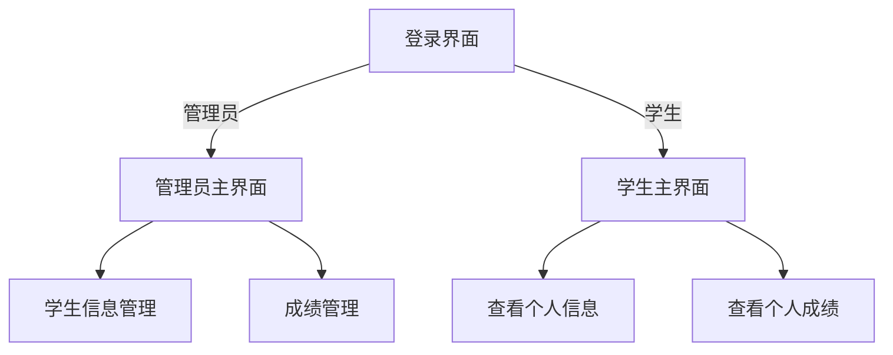
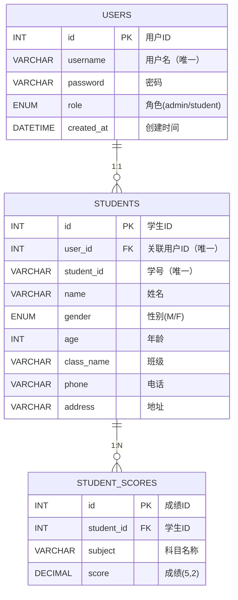

# 学生管理系统项目说明文档

> 来源：Obsidian/30-项目与实践/项目说明/学生管理系统/学生管理系统项目说明文档.md

## 项目概述

项目名称 ：学生管理系统 开发语言 ：Java 项目类型 ：桌面应用程序 主要用途 ：用于管理学生信息和成绩，支持管理员和学生两种角色操作 技术框架 ：Swing (UI) + JDBC (数据库连接)



## 一、功能模块

### 1. 用户认证模块

- 登录功能 ：支持管理员和学生角色登录，通过 `login` 方法验证用户身份
- 权限控制 ：根据不同角色显示不同操作界面和功能，通过 `isAdmin` 和 `isStudent` 方法实现权限判断

### 2. 学生信息管理模块

- 添加学生信息（管理员权限）：通过 `addStudent` 方法实现
- 查询学生信息（按学号或姓名）：通过 `queryStudent` 方法实现
- 修改学生信息：支持更新学号、姓名、性别等信息
- 删除学生信息（管理员权限）
- 查看所有学生信息

### 3. 成绩管理模块

- 添加/更新学生成绩：通过 `addOrUpdateScore` 方法实现
- 查看学生成绩：通过 `viewStudentScores` 方法实现
- 删除学生成绩：通过 `deleteScore` 方法实现

### 4. 个人信息模块

- 学生查看个人信息
- 学生查看个人成绩

## 二、技术架构

采用分层架构设计：

1. 界面层（SwingGUI） ：负责用户交互界面，包含 `LoginFrame.java` 、 `AdminMainFrame.java` 和 `StudentMainFrame.java` 等组件
2. 业务逻辑层（Service） ：处理核心业务逻辑，包含用户服务、学生服务和成绩服务
3. 数据访问层 ：通过JDBC连接数据库进行数据操作，由 `DatabaseConnection.java` 提供数据库连接管理

## 三、项目目录结构

```
StudentManagementSystem/
├── src/
│   ├── DatabaseConnection.java      // 数据库连接类
│   ├── Main.java                    // 程序入口
│   ├── Dialog/                      // 对话框组件
│   │   ├── AddStudentDialog.java    // 添加学生对话框
│   │   ├── DeleteStudentDialog.java // 删除学生对话框
│   │   ├── DisplayAllStudentsDialog.java // 显示所有学生对话框
│   │   ├── ManageScoresDialog.java  // 成绩管理对话框
│   │   ├── ModifyStudentDialog.java // 修改学生对话框
│   │   ├── QueryStudentDialog.java  // 查询学生对话框
│   │   ├── ViewProfileDialog.java   // 查看个人信息对话框
│   │   ├── ChangePasswordDialog.java   // 修改密码对话框
│   │   └── ViewScoresDialog.java    // 查看成绩对话框
│   ├── Service/                     // 服务层
│   │   ├── ScoreService.java        // 成绩服务类
│   │   ├── StudentService.java      // 学生服务类
│   │   └── UserService.java         // 用户服务类
│   └── SwingGUI/                    // GUI组件
│       ├── AdminMainFrame.java      // 管理员主界面
│       ├── GradientPanel.java       // 渐变面板组件
│       ├── LoginFrame.java          // 登录界面
│       └── StudentMainFrame.java    // 学生主界面
└── create_Stu_db.sql                // 数据库创建脚本
```

## 四、数据库配置

数据库连接信息在 `DatabaseConnection.java` 中配置：

- URL ： jdbc:mysql://localhost:3306/student_db
- 用户名 ： root
- 密码 ： 0128
  注意 ：数据库脚本文件 create_Stu_db.sql 未找到，需要手动创建数据库表结构。根据代码推断，至少需要以下表：

- users ：存储用户信息（id, username, password, role）
- students ：存储学生信息（id, user_id, student_id, name, gender, age, class_name, phone, address）
- student_scores ：存储学生成绩（id, student_id, subject, score）

## 五、运行说明

1. 确保已安装Java开发环境和MySQL数据库
2. 配置数据库连接信息（修改 `DatabaseConnection.java` 中的数据库URL、用户名和密码）
3. 初始化数据库表结构
4. 运行 `Main.java` 启动程序

## 六、角色说明

### 管理员角色

1. 使用管理员账号登录系统
2. 可进行学生信息管理（添加、查询、修改、删除）
3. 可进行成绩管理（添加/更新、查看、删除）

### 学生角色

1. 使用学生账号登录系统
2. 可查看个人信息
3. 可查看个人成绩

## 七、主要界面说明

### 登录界面

由 `LoginFrame.java` 实现，提供用户名和密码输入框，支持管理员和学生登录。

### 管理员主界面

由 `AdminMainFrame.java` 实现，包含学生信息管理和成绩管理功能入口。

### 学生主界面

由 `StudentMainFrame.java` 实现，提供个人信息和成绩查询功能。

## 八、数据库关系

### 1. ​核心关系模型​



### 2. ​关系详解​​

| 关系类型 | 相关表          | 关联字段                        | 约束条件               | 业务含义                                     |
| -------- | --------------- | ------------------------------- | ---------------------- | -------------------------------------------- |
| ​1:1​​   | users↔students | users.id = students.user_id     | UNIQUE FOREIGN KEY     | 一个用户账户对应唯一学生档案                 |
| ​​1:N​​  | students→scores | students.id = scores.student_id | FOREIGN KEY NOT NULL   | 一个学生可有多门科目成绩                     |
| 独立关系 | users独立       | -                               | role=admin时无学生关联 | 管理员用户仅有账户信息，无学生数据和成绩数据 |

### 3. ​关键唯一性约束

| 表名           | 唯一字段              | 作用                                       |
| -------------- | --------------------- | ------------------------------------------ |
| users          | username              | 确保登录账户唯一性                         |
| students       | user_id               | 防止重复绑定用户账户                       |
| students       | student_id            | 确保学号系统内唯一                         |
| student_scores | (student_id, subject) | 同一学生相同科目成绩唯一（由插入逻辑隐含） |
